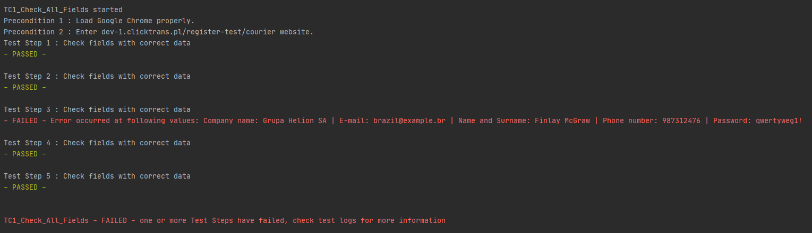

# Clicktrans-project
An automatic tests of the registration form

# Technologies

- Python (3.8)

# Frameworks

- selenium (Chrome Webdriver is required)

- colorama

# Requirements

- The script is compatible with Google Chrome ver. 84.0.4147.125

# Screenshots

# Setup
Click "Clone or download" unzip files, open project in PyCharm and set up interpreter with frameworks mentioned above

# Contact
Created by Szymon Kotlowski szymonkotlowski20@gmail.com

