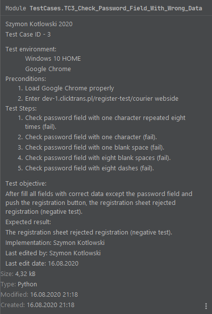

# Clicktrans-project
An automatic tests of the registration form

# Technologies

- Python

# Frameworks

- selenium (Chrome Webdriver is required)

- colorama

# Requirements

- The script is compatible with Google Chrome ver.84.0.4147.125

# Screenshots

